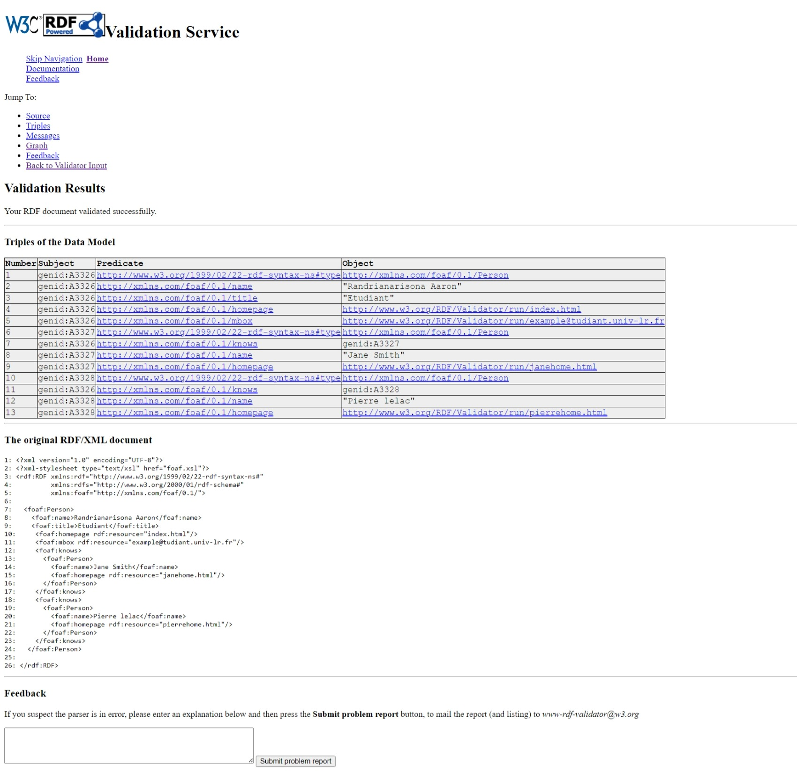
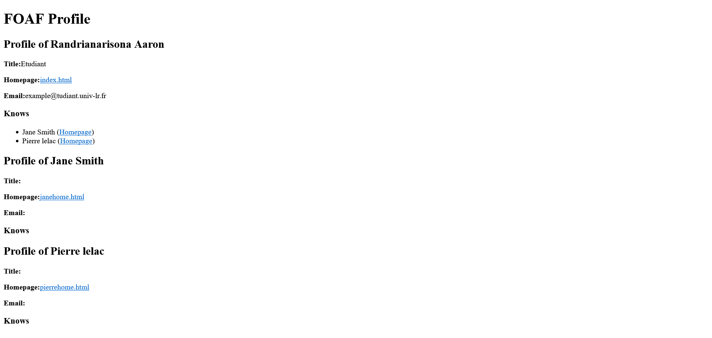
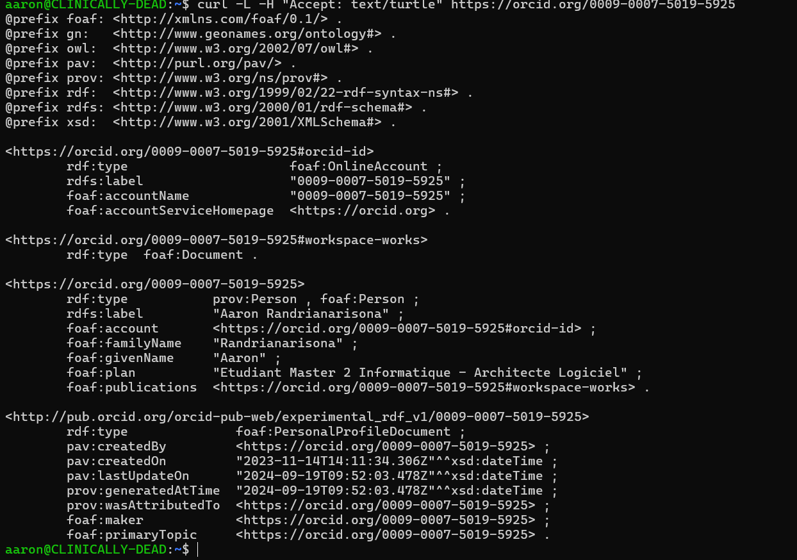
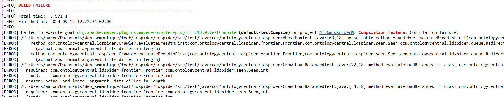

Randrianarisona Aaron

# Compte rendue

## Exercice 1

Validation de la page rdf par l'outil https://www.w3.org/RDF/Validator/ :

## Exercice 2

Utilisation de la feature Github Pages pour l'hébergement, sur le lien : https://randrianarisonaaaron.github.io/tp_foaf/

**NB**: Cet affichage est possible sur Mozilla Firefox,sur edge cela force le téléchargement uniquement.

## Exercice 3

Commande curl :

> curl -L -H "Accept: text/turtle" https://orcid.org/0009-0007-5019-5925

## Exercice 4

Erreurs lors de la récupération des dépendane avec la commande "mvn install", du projet en https://github.com/ldspider/ldspider.git

